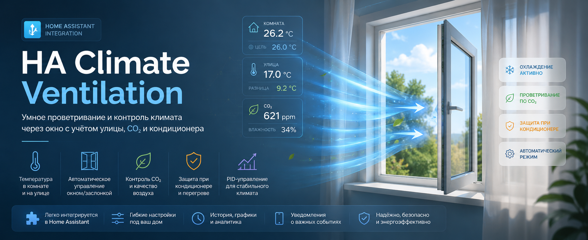
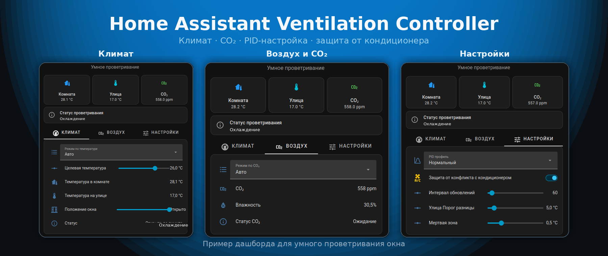

# Ventilation Controller

[English version](README.md)

  

  

Ventilation Controller — кастомная интеграция для Home Assistant, которая управляет окном, дверью, заслонкой или любой другой `cover`-сущностью с позицией от 0 до 100%.

Хорошо подходит для приводов Drivent, но не привязана к ним. Можно использовать любой Home Assistant `cover`, у которого есть управление положением от 0 до 100%.

Идея простая: окно открывается только тогда, когда от этого есть смысл.

Компонент смотрит на температуру в комнате, температуру на улице, целевую температуру, состояние кондиционера и CO₂. Если улица реально может охладить комнату, окно может открыться. Если на улице почти так же тепло или теплее, окно не открывается зря. Если включён кондиционер, окно может закрыться, чтобы не охлаждать улицу. Если CO₂ высокий, компонент может приоткрыть окно для проветривания, но с защитами, чтобы не переохладить комнату.

Проще говоря: это автоматика для умного проветривания. Окно открывается не “потому что жарко”, а потому что сейчас это действительно полезно.

## Содержание

- [Что Умеет](#что-умеет)
- [Как Это Работает](#как-это-работает)
- [Проветривание По Температуре](#проветривание-по-температуре)
- [Проветривание По CO₂](#проветривание-по-co₂)
- [PID](#pid)
- [Статусы](#статусы)
- [Настройки И Сущности](#настройки-и-сущности)
- [Установка](#установка)
- [Заметки](#заметки)
- [Авторы](#авторы)

## Что Умеет

- Управляет окном, дверью, заслонкой или вентиляционной створкой через Home Assistant `cover`
- Совместима с приводами Drivent и другими `cover` с позицией 0-100%
- Считает позицию окна по температуре комнаты и целевой температуре
- Учитывает температуру на улице, если датчик выбран
- Поддерживает проветривание по температуре: `disabled`, `force`, `auto`
- Не открывает окно, если улица не помогает охлаждать комнату
- Использует мёртвую зону температуры, чтобы окно не дёргалось около цели
- Может учитывать кондиционер и закрывать окно, когда кондиционер охлаждает
- Может учитывать CO₂ и проветривать по качеству воздуха
- Не делает CO₂ отдельной автоматизацией: CO₂ участвует в общем расчёте позиции окна
- Показывает понятные статусы по температуре и CO₂
- Выносит настройки в сущности Home Assistant

## Как Это Работает

Интеграция управляет одной `cover`-сущностью. Эта сущность должна поддерживать установку позиции в процентах.

По температуре компонент считает PID-выход: какую позицию окна нужно поставить между минимальным и максимальным положением. В режиме `auto` он сначала проверяет, достаточно ли улица холоднее комнаты. Если нет, PID блокируется, потому что открывать окно бессмысленно.

По CO₂ компонент может добавить временную минимальную позицию окна. Например:

- PID хочет открыть окно на `10%`
- CO₂ высокий и просит минимум `30%`
- итоговая позиция окна будет `max(10, 30) = 30%`

Если PID уже хочет `100%`, CO₂ ничего не перебивает. Он просто показывает, что проветривание по CO₂ активно, но окно и так открыто сильнее, чем просит CO₂.

## Проветривание По Температуре

### `disabled`

Контроллер выключен.

- PID не работает
- окно переводится в минимальное положение
- статус контроллера: `disabled`

### `force`

PID работает только по температуре комнаты.

- датчик улицы не нужен
- разница температур с улицей не блокирует PID
- статус контроллера: `cooling`, пока PID регулирует окно

### `auto`

PID работает только если улица может охлаждать комнату.

- нужен датчик улицы
- `Разница с улицей = температура комнаты - температура улицы`
- PID разрешён, когда разница больше или равна порогу
- PID блокируется, когда разница ниже порога с учётом гистерезиса
- между этими значениями сохраняется предыдущее состояние: разрешено или заблокировано

Если датчик улицы недоступен в режиме `auto`, PID блокируется, а окно переводится в минимальное положение.

## Проветривание По CO₂

CO₂ — опциональная часть. Если датчик CO₂ не выбран, CO₂-логика и CO₂-сущности не создаются.

Если датчик CO₂ выбран, интеграция может создать:

- сенсор `CO₂`
- сенсор `Статус CO₂`
- режим `Проветривание CO₂`: `Выключено` или `Авто`
- порог и гистерезис CO₂
- позицию проветривания CO₂
- проверку “CO₂ не снижается”
- защиты для холодной улицы

CO₂ не отправляет отдельные команды окну. Он только добавляет минимальную позицию в общий расчёт.

Проветривание по CO₂ блокируется, если:

- режим охлаждения выключен
- включена защита при кондиционере, и кондиционер охлаждает
- режим `auto` считает, что улица не подходит для охлаждения
- комната уже около целевой температуры или ниже неё

## PID

PID-логика похожа на `node-red-contrib-pid`:

- `PID Пропорциональная зона` — температурный диапазон, который растягивает выход от 0 до 100%
- `PID Время интегрирования` — время интегрирования в секундах; чем больше значение, тем медленнее интегральная поправка
- `PID Время дифференцирования` — время дифференцирования в секундах; `0` отключает дифференциальную часть
- для охлаждения выход инвертирован: чем выше температура комнаты относительно цели, тем сильнее открывается окно

## Статусы

Основной статус объясняет решение по окну и температуре:

- `Выключено` — режим охлаждения выключен
- `Охлаждение` — PID регулирует окно
- `Мёртвая зона` — температура около цели, окно не двигается
- `Малая разница температур` — улица не помогает охлаждать комнату
- `Окно закрыто: кондиционер` — защита при кондиционере закрыла окно
- `Нет датчика улицы` — датчик улицы недоступен в режиме `auto`
- `Нет датчика комнаты` — датчик комнаты недоступен
- `Окно недоступно` — управляемая `cover`-сущность недоступна
- `Ожидание` — охлаждение сейчас не требуется
- `Открыто до лимита` — PID дошёл до предела, интегральная часть временно не накапливается
- `Проветривание по CO₂` — CO₂ поднял итоговую позицию окна выше PID
- `CO₂ не снижается` — окно открыто для CO₂, но CO₂ не падает достаточно быстро
- `Ошибка` — неожиданная ошибка обновления контроллера

Отдельный `Статус CO₂` объясняет именно CO₂-логику:

- `Выключено`
- `Ожидание`
- `Высокий CO₂`
- `Проветривание по CO₂`
- `CO₂: малая разница температур`
- `CO₂: кондиционер`
- `CO₂: комната у цели`
- `CO₂ не снижается`

## Настройки И Сущности

Основные элементы управления:

- `Проветривание по температуре`: `Выключено`, `Принудительно`, `Авто`
- `Проветривание CO₂`: `Выключено`, `Авто`, появляется только если выбран датчик CO₂
- `Защита при кондиционере`, появляется только если выбран кондиционер
- `Цель`
- `Комната`
- `Улица`
- `Окно`
- `Статус`

Настройки:

- `Профиль PID`
- `PID Пропорциональная зона`
- `PID Время интегрирования`
- `PID Время дифференцирования`
- `Температура Мёртвая зона`
- `Улица Порог разницы`
- `Улица Гистерезис разницы`
- `Окно Порог движения`
- `Система Интервал обновления`
- настройки CO₂: порог, гистерезис, позиция проветривания, таймаут, минимальное снижение и защиты от холодной улицы

Диагностика:

- `Разница с улицей`
- `Выход PID`
- `Позиция CO₂`

## Установка

### HACS

1. Открой HACS.
2. Добавь этот репозиторий как custom integration repository.
3. Установи **Ventilation Controller**.
4. Перезапусти Home Assistant.
5. Открой **Настройки -> Устройства и службы -> Добавить интеграцию**.
6. Выбери датчик комнаты, датчик улицы при необходимости, кондиционер при необходимости, датчик CO₂ при необходимости и управляемое окно/дверь/заслонку.

### Ручная Установка

Скопируй `custom_components/ventilation_controller` в `/config/custom_components/ventilation_controller` и перезапусти Home Assistant.

## Заметки

- Управляемый `cover` должен поддерживать позицию 0-100%.
- Режим `force` может работать без датчика улицы.
- Режим `auto` требует датчик улицы.
- Защита при кондиционере не включает и не выключает кондиционер; она только смотрит на его состояние.
- CO₂ не управляет окном отдельно; он участвует в общем расчёте итоговой позиции.

## Авторы

Создано [@samsonovss](https://github.com/samsonovss) с помощью Тени, персонального AI-агента OpenClaw.
